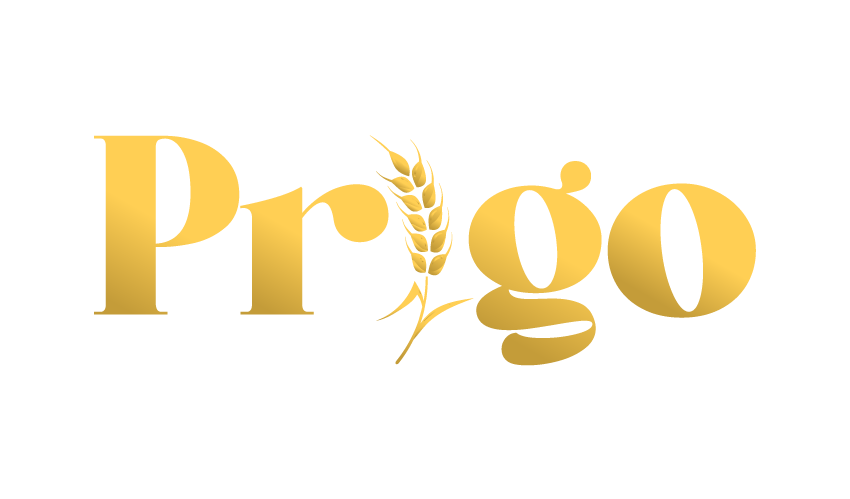

<!--
*** Thanks for checking out the Best-README-Template. If you have a suggestion
*** that would make this better, please fork the repo and create a pull request
*** or simply open an issue with the tag "enhancement".
*** Don't forget to give the project a star!
*** Thanks again! Now go create something AMAZING! :D
-->

<!-- PROJECT SHIELDS -->
<!--
*** I'm using markdown "reference style" links for readability.
*** Reference links are enclosed in brackets [ ] instead of parentheses ( ).
*** See the bottom of this document for the declaration of the reference variables
*** for contributors-url, forks-url, etc. This is an optional, concise syntax you may use.
*** https://www.markdownguide.org/basic-syntax/#reference-style-links
-->

<!-- PROJECT LOGO -->
 

  

<h3 align="center">Prigo: panadería y premezclas</h3>

  

    Proyecto de inversión
     
     
    <a href="https://drive.google.com/file/d/1PLDeBOdSIlyrEh0oqoMjwC94PaO_JVxa/view?usp=sharing">Resumen ejecutivo</a>
    ·
    <a href="https://www.canva.com/design/DAEtRUw5jSs/K0mrUIlHAPGLiVQPEuZm6w/view?utm_content=DAEtRUw5jSs&utm_campaign=designshare&utm_medium=link&utm_source=sharebutton">Reviví la presentación</a>
    ·
    <a href="#contacto">Contacto</a>
    ·
    <a href="#integrantes">Integrantes</a>
  

<!-- ABOUT THE PROJECT -->
## Acerca del proyecto

Prigo nace como una respuesta a los cambios en los hábitos de consumo de los hogares del país. Con el propósito de llevar una nueva alternativa a las mesas, se propone incorporar ingredientes lo más naturales posibles aprovechando la calidad y características tanto del suelo argentino como de sus productos agrícolas.

(<a href="#top">volver arriba</a>)

## Misión, visión y valores

* Gracias a una amplia red de clientes, Prigo busca llegar a las cocinas, y agasajar con el más rico bocado dulce en cualquier momento del día o en una ocasión especial.
* Ser una marca de renombre entre los productos de panadería industriales, conocida por la intensidad de sus sabores y la calidad de sus texturas, similares a un producto “hecho en casa” para lograr la fidelidad de cada uno de sus clientes.
* Brindar confianza, y ofrecer con calidad, calidez, compromiso y eficacia, el sabor único que sus clientes esperan son los pilares de nuestra organización.

(<a href="#top">volver arriba</a>)

<!-- CONTACT -->
## Contacto

Visitanos en Instagram - [@prigo.estilocasero](https://instagram.com/prigo.estilocasero)

Sitio web – [www.prigo.com.ar](https://mecepeda.github.io/prigo-estilocasero)

(<a href="#top">volver arriba</a>)

## Cátedra – Proyecto final | UTN.FRBA

* Ing. Alejandro Rosá
* Ing. Pablo Romero

<!-- ACKNOWLEDGMENTS -->
## Integrantes

* Cepeda, Matías Ezequiel
* Palacio, Facundo
* Rodriguez Gerini, Santiago
* Rutsztein, Micaela

(<a href="#top">volver arriba</a>)

<!-- MARKDOWN LINKS & IMAGES -->
<!-- https://www.markdownguide.org/basic-syntax/#reference-style-links -->
[contributors-shield]: https://img.shields.io/github/contributors/github_username/repo_name.svg?style=for-the-badge
[contributors-url]: https://github.com/github_username/repo_name/graphs/contributors
[forks-shield]: https://img.shields.io/github/forks/github_username/repo_name.svg?style=for-the-badge
[forks-url]: https://github.com/github_username/repo_name/network/members
[stars-shield]: https://img.shields.io/github/stars/github_username/repo_name.svg?style=for-the-badge
[stars-url]: https://github.com/github_username/repo_name/stargazers
[issues-shield]: https://img.shields.io/github/issues/github_username/repo_name.svg?style=for-the-badge
[issues-url]: https://github.com/github_username/repo_name/issues
[license-shield]: https://img.shields.io/github/license/github_username/repo_name.svg?style=for-the-badge
[license-url]: https://github.com/github_username/repo_name/blob/master/LICENSE.txt
[linkedin-shield]: https://img.shields.io/badge/-LinkedIn-black.svg?style=for-the-badge&logo=linkedin&colorB=555
[linkedin-url]: https://linkedin.com/in/linkedin_username
[product-screenshot]: images/screenshot.png
